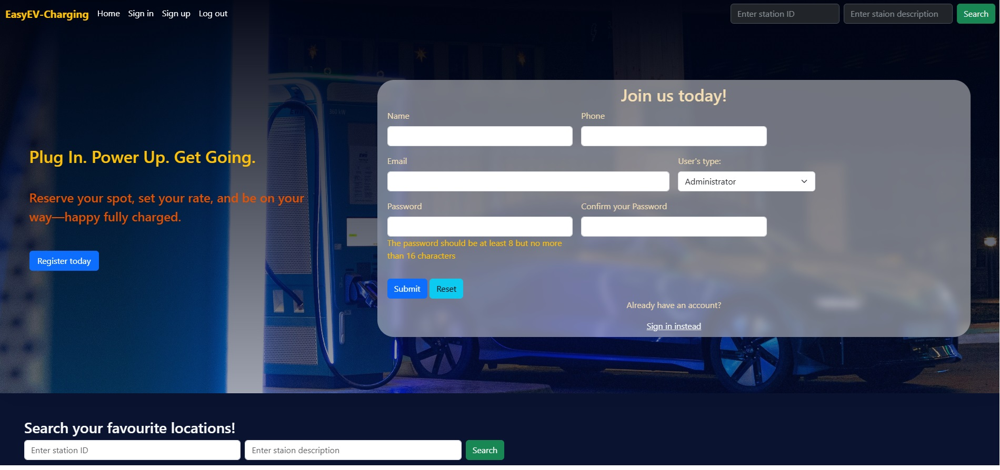
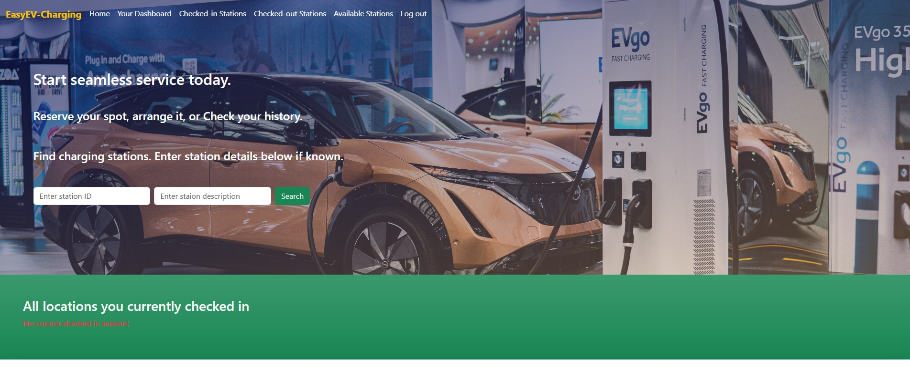
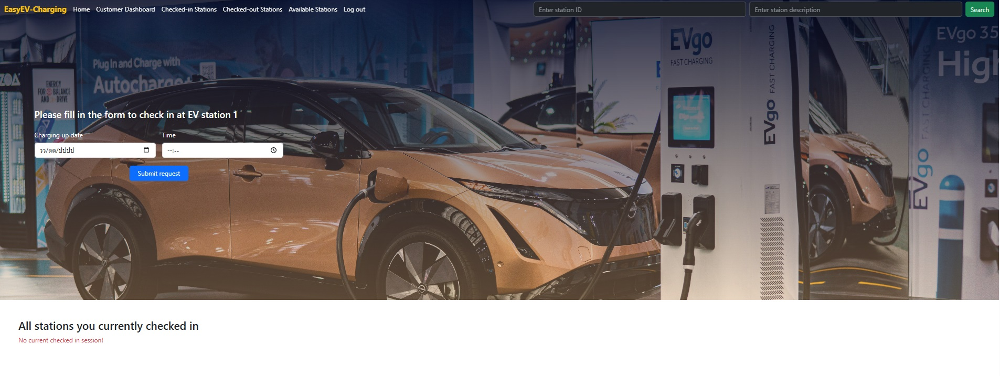
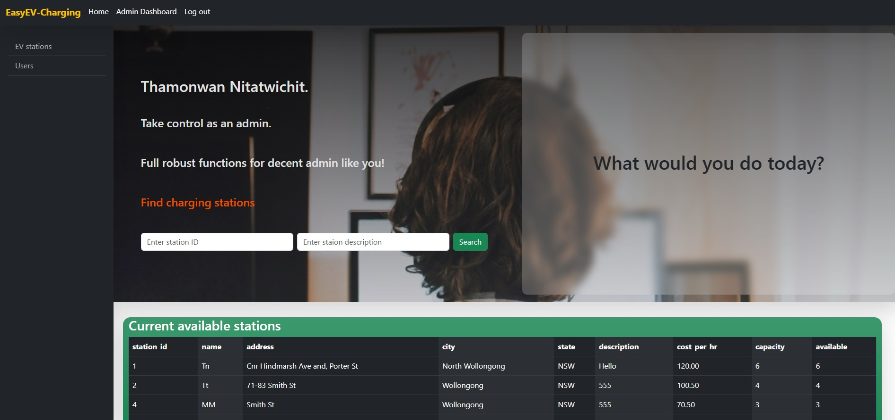

# EasyEV Charging

**A PHP and MySQL application for managing EV charging locations, customer sessions, availability, and charging costs.**

EasyEV models a real operational workflow with two roles: **Customer** and **Administrator**. Customers can find available charging locations, check in, check out, and review their charging history. Administrators can manage charging locations and monitor users and active sessions.

This project was completed as a major assignment for **MTS9307 Web Server Programming**.

## Project at a glance

| Area | Implementation |
|---|---|
| Backend | Object-oriented PHP |
| Database | MySQL with MySQLi |
| Front end | HTML, CSS, Bootstrap 5 |
| Roles | Customer and Administrator |
| Core workflows | Authentication, station CRUD, search, check-in, check-out, availability, cost calculation |
| Local environment | XAMPP/WAMP/MAMP or Docker |

## My contribution

- Translated operational requirements into customer and administrator workflows
- Designed relational data structures for users, charging stations, and sessions
- Implemented reusable object-oriented PHP domain and database logic
- Built CRUD operations, authentication, validation, availability rules, and cost calculation
- Developed responsive role-specific interfaces with Bootstrap
- Tested input handling, database behaviour, normal workflows, and error conditions
- Documented the architecture, setup process, limitations, and potential improvements

## Screenshots

### Home and authentication

### Customer dashboard

### Customer check-in workflow

### Administrator dashboard

Additional screenshots are available in [docs/screenshots](docs/screenshots).

## Why this project matters

Many operational processes still depend on manual records or disconnected spreadsheets. EasyEV demonstrates how a database-driven application can:

- centralise locations, capacity, users, and charging sessions,
- enforce availability and active-session rules,
- provide separate interfaces for different user roles, and
- make current and historical information easier to understand.

## Key features

### Customer features

- Register, sign in, and sign out
- View and search charging locations
- See current availability
- Check in to start a charging session
- Check out and view the calculated cost
- Review active sessions and charging history

### Administrator features

- Add and modify charging locations
- View all, available-only, or full stations
- Search charging locations
- View registered users
- View users with active charging sessions

## High-level architecture

### Presentation layer

- PHP templates render the Bootstrap 5 interface
- Helper functions generate reusable tables and cards
- Responsive layouts support desktop and mobile viewing

### Domain layer

Reusable PHP traits and classes separate the main business logic:

- `database` trait: connection and database initialisation
- `EV` trait: charging-station CRUD and validation
- `Session` trait: check-in, check-out, and cost calculation
- `User` class: registration, login, and customer actions
- `Admin` class: administrator reporting and management actions

### Data layer

The application initialises three main tables:

- `users`: registered accounts and roles
- `charging_stations`: station capacity and live availability
- `sessions`: session start, end, and calculated cost

## Validation and error handling

- Client-side Bootstrap validation communicates input state
- Server-side regular-expression checks validate inputs before database operations
- Database operations use `mysqli_sql_exception` handling
- Error messages are returned to the interface for user feedback

## Local setup

### Option 1: XAMPP, WAMP, or MAMP

1. Place the project in the local web-server root, such as `htdocs`.
2. Start Apache and MySQL.
3. Open `http://localhost/<project-folder>/index.php`.
4. If necessary, update the database connection in `classes.php`.

The application attempts to create the `EasyEV_Charging` database and required tables when they do not exist.

### Option 2: Docker

The repository includes a `Dockerfile` and `docker-compose.yml` for a container-based local environment.

## Project structure

- `index.php`: authentication, public search, and available stations
- `signInForm.php`, `signUpForm.php`: authentication forms
- `classes.php`: domain and database logic
- `adminPanel.php`: administrator dashboard
- `addEV.php`, `editEV.php`: station management
- `customerPanel.php`: customer dashboard
- `customerCheckIn.php`, `customerCheckOut.php`: charging-session workflow
- `admin-functions.php`, `customer-functions.php`: presentation helpers
- `style_sheet.css`: interface styling
- `docs/screenshots`: portfolio screenshots

## Security and scope

This is an academic demonstration rather than a production service.

- The assignment implementation uses MD5 password hashing. A production version should use `password_hash()` and `password_verify()`.
- Payment processing is outside the project scope; the application calculates and displays session cost only.
- A production deployment would also require CSRF protection, stricter authorization checks, environment-based secrets, and further security testing.

## What I learned

- Translating a business workflow into database entities and application rules
- Building an end-to-end role-based CRUD application
- Separating reusable domain logic from presentation helpers
- Designing predictable validation and error-handling behaviour
- Documenting both implementation strengths and technical limitations honestly

## Author

**Thamonwan (Dream) Nitatwichit**

[GitHub profile](https://github.com/DreamThamonwan) | [LinkedIn](https://www.linkedin.com/in/thamonwan-nitatwichit-982566255/)
